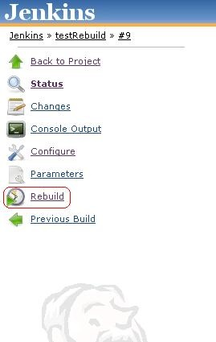
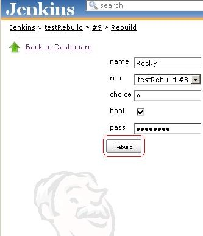

# Rebuild Plugin

This plug-in allows the user to *rebuild* a *parametrized build* without
entering the *parameters* again.It will also allow the user to edit the
parameters before rebuilding.

# Usage

Once you installed this plug-in whenever you execute a parametrized
build you will get a rebuild button in the left pane of the run as shown
in the image. If you want to execute the build with same parameters,
rebuild plug-in will allow you to build it through rebuild button.If you
want to edit some of the existing parameters, the rebuild plug-in will
allow you to edit the existing parameters and build it.

## How to rebuild

**Steps to rebuild**

-   Select the run of the job which you want to rerun.
-   There will be a ***Rebuild*** button as shown in the image given
    below.

- 

-   Click on the ***Rebuild*** button. A configuration page contains the
    existing parameters will appear as shown in the below image.

-   

-   If you want to edit some existing parameters(for ex: name and
    choice) , you can edit it and Rebuild it by clicking the
    ***Rebuild*** button.

# Changelog
- Changelog can be found [here](docs/CHANGELOG.md)
