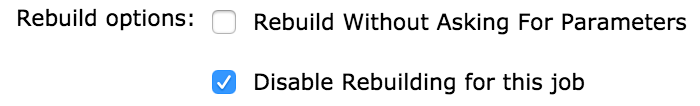

# Change Log

#### Version 1.31 (Apr 28, 2019)

-   Make sure that a single instance of UserIDCause and RebuildCause are
    added to the build causes

#### Version 1.30 (Mar 25, 2019)

-   Fix CauseAction issues.
    See <https://github.com/jenkinsci/rebuild-plugin/pull/56>

#### Version 1.29 (Sep 25, 2018)

-   [Fix security issue](https://jenkins.io/security/advisory/2018-09-25/#SECURITY-130)

#### Version 1.28 (Mar 28, 2018)

-   Updated required Jenkins Core to 1.642.3
-   Additional Null-checks
-   Fix root-url
-   Handle NodeParameters correctly

#### Version 1.27 (Oct 18, 2017)

- Display more informative error messages

- Ensure inherited parameters are added to rebuilds

#### Version 1.25 (Jun 25, 2015)

- Add option to disable the rebuild plugin on the project level

#### Version 1.20 (Sept 13, 2013)

- Fixed
[JENKINS-15882](https://issues.jenkins-ci.org/browse/JENKINS-15882).

- Fixed
[JENKINS-14828](https://issues.jenkins-ci.org/browse/JENKINS-14828).

- Blocked rebuilding matrix configuration alone.

- Rebuild option for parameter less build.

#### Version 1.18 (Feb 24, 2013)

-  Fix
[JENKINS-16874](https://issues.jenkins-ci.org/browse/JENKINS-16874) -
java.lang.NullPointerException: Current Project is null

#### Version 1.17 (Feb 06, 2013)

- "Rebuild Last"  feature allows to rebuild last build implemented.

-  [JENKINS-14905](https://issues.jenkins-ci.org/browse/JENKINS-14905)
fixed.

#### Version 1.16 (Nov 14, 2012)

- Rebuild support for non parametrized build  
    implemented.

#### Version 1.16 (Nov 14, 2012)

- Rebuild support for non parametrized build  
    implemented.

- Required Jenkins Core Version is 1.481.

#### Version 1.15 (Oct 12, 2012)

- Rebuild support for jobs having subversion/text parameter  
    implemented.

- Required Jenkins Core Version is 1.481.

#### Version 1.14 (July 8, 2012)

- fix
[JENKINS-11770](https://issues.jenkins-ci.org/browse/JENKINS-11770) add
support for NodeLabel parameter plugin

#### Version 1.13 (June 11, 2012)

- Enabled rebuild plugin support for parametrized triggered plugin with
basic type of parameters like String-parameter,Boolean-parameter,  
  File-parameter,Text-parameter and Password-parameter. Currently there
is no support for Run-parameter for Parametrized triggered plugin.

- Disabled the rebuild option for sub jobs of matrix build.

#### Version 1.12 (June 06, 2012)

- Fix reponed
[JENKINS-13647](https://issues.jenkins-ci.org/browse/JENKINS-13647)

#### Version 1.11 (May 13, 2012)

- Fix NullPointerException for
[JENKINS-13647](https://issues.jenkins-ci.org/browse/JENKINS-13647)

#### Version 1.7 (Mar 2, 2011)

-   Enhanced the rebuild plug-in so that the editing option of build
    parameters before rebuild is introduced. \[Doesnt have backward
    compatibility. An exception at startup. **Seems minor and e are
    working on fix however doesnt affect functionality**\]

#### Version 1.4 (Sept 15, 2010)

-   Disabling the rebuild option while selecting Run and File parameters
    is implemented

#### Version 1.1 (Jul 16, 2010)
